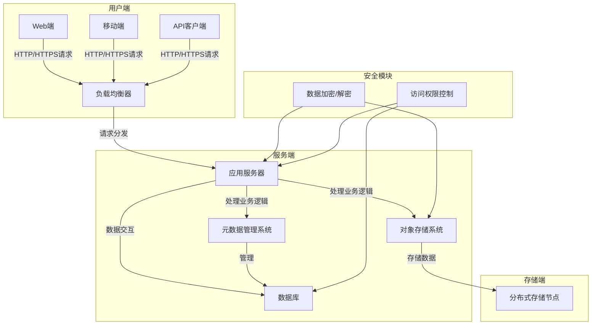

# occrq-cloud-disk


[](https://ci.appveyor.com/project/wangyi1310/mycloud-disk)
<a href="https://gitmoji.dev">
  
</a>

🔥 开启 Go 语言云盘项目之旅
这是一个使用 Go 语言开发的项目，致力于打造一个高效、安全的云盘系统。

## 项目简介
本项目已具备基本的云盘功能框架，涵盖初始化应用、路由管理、数据库连接等核心功能。

## 项目截图
### 主界面
此截图展示了云盘的主界面，用户可在此进行文件的上传、下载和管理操作。

### 管理界面
管理员能够在该界面进行系统配置和用户管理。

## 运行环境
- **Go 23.1**

## 运行步骤
1. **安装 Go 环境**：确保你已安装 Go 23.1 或更高版本。
2. **克隆项目**：
    ```bash
    git clone https://github.com/wangyi1310/occrq-cloud-disk.git
    cd occrq-cloud-disk
    ```
3. **编译并运行**：
    ```bash
    go build -ooccrq-cloud-disk .
    ./occrq-cloud-disk
    ```
### Docker运行

## 项目结构
### 项目模块结构


使用  [gitdiagram](https://gitdiagram.com/) 自动生成。

### 架构



### 详细目录说明
- **根目录**：
    - `Dockerfile`：用于构建 Docker 镜像的文件。
    - `README.md`：本项目说明文档。
    - `bootstrap/`：项目初始化相关代码。
        - `app.go`：应用初始化和更新检查。
        - `init.go`：项目初始化入口。
    - `conf/`：项目配置文件。
        - `conf.go`：配置解析和验证。
        - `defaults.go`：默认配置。
        - `version.go`：项目版本信息。
    - `go.mod`：定义项目的模块信息和 Go 版本。
    - `main.go`：包含程序的入口函数 `main`。
    - `models/`：数据库模型和连接相关代码。
        - `init.go`：数据库初始化和连接。
    - `pkg/`：项目工具包。
        - `log/`：日志记录工具。
        - `request/`：HTTP 请求工具。
        - `util/`：通用工具函数。
    - `routers/`：路由管理。
        - `controllers/`：控制器，处理具体的业务逻辑。
        - `router.go`：路由初始化和配置。
    - `serializer/`：序列化和反序列化相关代码。
        - `response.go`：响应序列化。

## 模块说明
### bootstrap
- `InitApplication()`：初始化应用，打印应用信息并启动更新检查。
- `CheckUpdate()`：检查 GitHub 上是否有新版本可用。

### conf
- `system` 结构体：存储系统配置信息，包括运行模式、监听地址等。
- `mapSection()`：解析配置文件并验证配置的合法性。

### models
- `Init()`：初始化数据库连接，根据配置选择不同的数据库类型。
- `connectSQLite()` 和 `connectMySQL()`：分别用于连接 SQLite 和 MySQL 数据库。

### pkg/util
- `RandStringRunes()`：生成随机字符串。
- `ContainsUint()` 和 `ContainsString()`：检查切片中是否包含指定元素。
- `IsInExtensionList()`：检查文件扩展名是否在指定列表中。
- `Replace()`：根据替换表执行批量替换。
- `BuildRegexp()`：构建用于 SQL 查询的多条件正则表达式。
- `BuildConcat()`：根据数据库类型构建字符串连接表达式。
- `SliceIntersect()` 和 `SliceDifference()`：求两个切片的交集和差集。

### routers
- `Init()`：根据配置的运行模式初始化路由。
- `InitMaster()` 和 `InitSlave()`：分别初始化主模式和从模式的路由。

### pkg/log
- `Logger` 结构体：日志记录器，支持不同级别的日志输出。
- `BuildLogger()`：构建日志记录器。
- `Log()`：返回日志记录器实例。


## 贡献指南
如果你想为这个项目做出贡献，请参考 [贡献指南](CONTRIBUTING.md)。


## 许可证
本项目采用 [MIT 许可证](LICENSE)。
